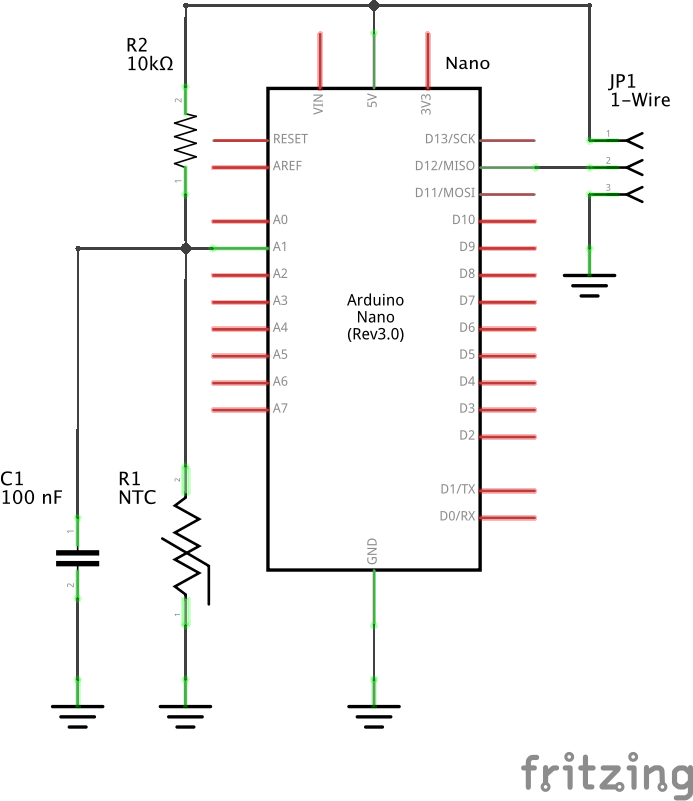

I've made this device to connect my [NTC thermistor](https://en.wikipedia.org/wiki/Thermistor#NTC) to a [Livolo thermostat](https://www.livolo.eu/c-4632899/livolo-thermostat/) which only works with a built-in [DS18B20 digital thermometer](https://www.maximintegrated.com/en/products/sensors/DS18B20.html).

[](https://github.com/eigenein/ntc-one-wire/releases)
[](https://www.arduino.cc/en/Guide/ArduinoNano)
[](https://platformio.org/)

## Instructions

### [`table.h`](src/table.h)

You need to generate the [`table.h`](src/table.h) for your particular NTC thermistor. It contains an array which maps a measured ADC value to actual temperature. You can do this via the provided [`table.py`](table.py) script.

Measure your NTC resistance at two different temperature points. Then call [`table.py`](table.py) specifying your measurements:

```sh
python table.py \
    --t1 <temperature-1> --r1 <resistance-at-t1> \
    --t2 <temperature-2> --r2 <resistance-at-t2> \
    --rf <fixed-resistor>
```

If your program memory is too small, you can specify `--min-t` and/or `--max-t` parameters. Then the table will be generated in a specified temperature range generating less array entries thus taking less memory.

See [Measuring the temperature with NTCs](http://www.giangrandi.ch/electronics/ntc/ntc.shtml) for more information on how the conversion is implemented.

### Schematic

- `R2` is a fixed resistor with a known resistance. Start with a one that is close to your typical NTC resistance. I recommend to measure actual resistance of the resistor before passing it as `--rf` to improve readings accuracy.
- `C1` aims to filter noise on the NTC wires. It may be tempting to remove it but then you'll sometimes get inadequate readings.
- I use `MISO` pin for 1-Wire data line because then I'm able to solder the power and data wires close to each other [on the ICSP header](https://www.arduino.cc/en/reference/SPI).
- I used a self-fusing electrical tape to wrap the entire Arduino board and put it into a flush-mounted box behind the thermostat.



### Note for Livolo thermostats

In short, damn them! 😡

1. Livolo's 1-Wire master has non-standard timings and reads only the first 2 bytes of the entire DS18B20's response. You'll need to patch [OneWireHub](https://github.com/orgua/OneWireHub)'s `OneWireHub_config.h` and `DS18B20.cpp` using the included [`livolo.patch`](livolo.patch). See also https://github.com/orgua/OneWireHub/issues/84.
1. (Still checking this point.) Supposingly, one has to solder out the second sensor deep inside the thermostat **even before turning it on for the first time**. If you've already done that, you may try to figure out the calibrated temperature offset that the thermostat has calculated and remembered. Wait ~4 minutes and note the difference between displayed and real ambient temperatures. Then, change `livoloOffset` in the source code to compensate this.
